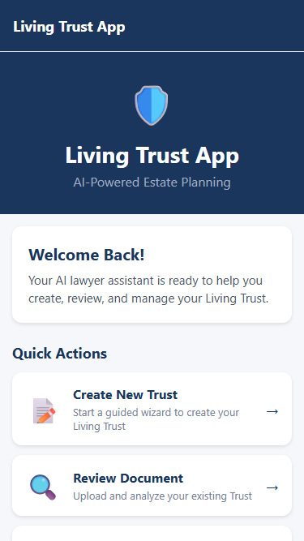
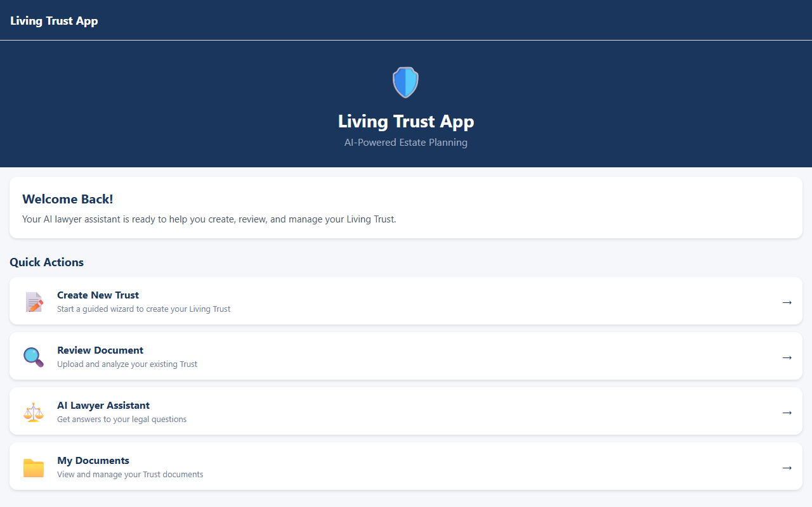

# Living Trust App

AI-powered mobile app to help people create, overview, and review Living Trust documents with an AI lawyer assistant.

## 🎯 Purpose

The **Living Trust App** helps users:
- ✅ Create a Living Trust with guided wizard
- ✅ Review existing Trust documents with AI analysis
- ✅ Get legal guidance from AI lawyer assistant
- ✅ Store and manage Trust documents securely

## 📱 Platform

- **iOS:** React Native (iOS build ready)
- **Android:** React Native (Android build ready)
- **Web:** Progressive Web App (mobile & desktop)
- **Backend:** Node.js Microservices API

## 📸 How to Generate a Trust Document

Follow these steps to create your Living Trust:

### Step 1: Launch the App
Open the Living Trust App on your device or web. Tap **"Create Trust"** on the home screen.

### Step 2: Fill in Basic Information
- Enter Trust Name (required)
- Select Trust Type: Revocable or Irrevocable
- Tap **"Next"** to continue

### Step 3: Add Grantor Details
- Enter your full legal name
- Add your address
- Tap **"Next"**

### Step 4: Add Beneficiaries
- List your beneficiaries (who inherits)
- Specify their relationship
- Tap **"Next"**

### Step 5: Select Successor Trustee
- Choose who manages the trust after you
- Tap **"Next"**

### Step 6: Review & Create
- Review all information
- Tap **"Create Now"** button
- See success confirmation popup

---

## 📷 App Screenshots

| Screen | Description |
|--------|-------------|
| Home | Main dashboard with quick actions |
| Create Trust | 5-step wizard form |
| AI Assistant | Chat with AI lawyer |
| Documents | View saved trusts |
| Review | AI document analysis |
| Settings | App preferences |

### Mobile View (375px)


### Desktop View (1280px)


### Trust Wizard (Mobile)


---

## 🖥️ Web App Preview

The app is fully responsive and works on:

| Device | Viewport |
|--------|----------|
| Mobile | 375px |
| Tablet | 768px |
| Desktop | 1280px+ |

---

## 🛠 Tech Stack

### Frontend
- React Native (Expo)
- TypeScript
- React Navigation
- Axios (API calls)

### Backend
- Node.js + Express
- TypeScript
- MongoDB (or PostgreSQL with Supabase)
- JWT Authentication
- OpenAI API (for AI lawyer features)

## 📂 Project Structure

```
Living-Trust-App/
├── frontend/          # React Native app
│   ├── src/
│   │   ├── screens/   # App screens
│   │   ├── components/ # Reusable components
│   │   ├── services/  # API services
│   │   ├── types/     # TypeScript types
│   │   └── utils/    # Utility functions
│   ├── App.tsx       # Main app entry
│   └── package.json
│
├── backend/           # Node.js API
│   ├── src/
│   │   ├── routes/   # API routes
│   │   ├── controllers/ # Business logic
│   │   ├── models/   # Database models
│   │   ├── services/ # Services
│   │   └── middleware/ # Middleware
│   ├── index.ts      # Server entry
│   └── package.json
│
└── README.md         # This file
```

## 🚀 Getting Started

### Prerequisites
- Node.js 18+
- npm or yarn
- Expo CLI
- MongoDB (local or Atlas)

### Frontend Setup
```bash
cd frontend
npm install
npx expo start
```

### Backend Setup
```bash
cd backend
npm install
npm run dev
```

### Web Build
```bash
cd frontend
npx expo export --platform web
# Serve with: npx serve dist
```

## 🔧 Environment Variables

### Backend (.env)
```
PORT=3001
MONGODB_URI=mongodb://localhost:27017/living-trust
JWT_SECRET=your-secret-key
OPENAI_API_KEY=sk-...
```

## 📄 License

MIT

## 👤 Author

- Your Name

---

*Built with ❤️ for helping people secure their legacy*
