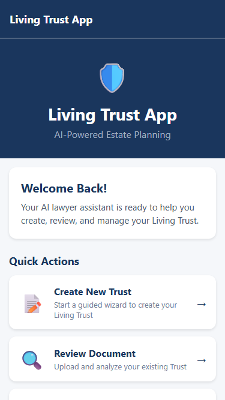
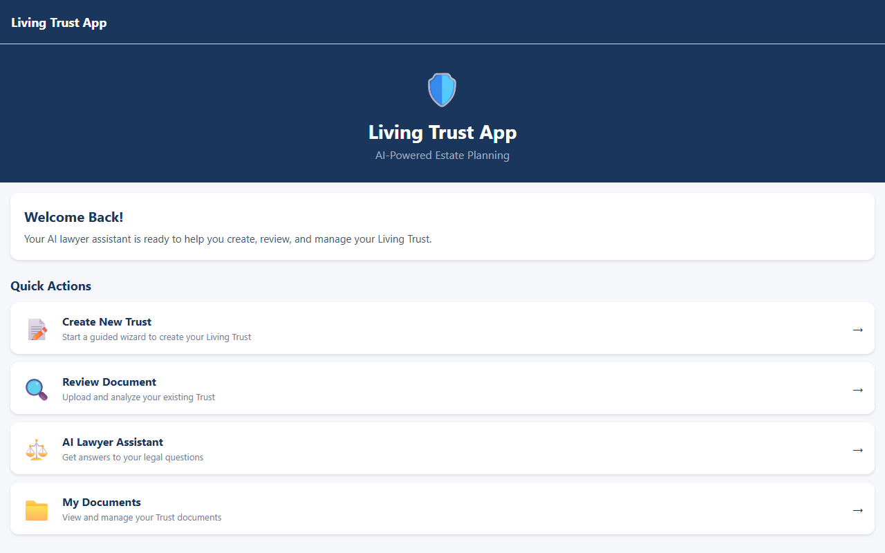

# Living Trust App — Android (Kotlin)

Native Android app for the Living Trust platform, built with Kotlin + Jetpack Compose and a clean MVVM architecture.

---

## App Screenshots

### Home Screen


### Trust Wizard


### Desktop Preview (Web Reference)


---

## Tech Stack

| Layer | Technology |
|-------|-----------|
| Language | Kotlin 2.0 |
| UI | Jetpack Compose + Material3 |
| Architecture | MVVM + Clean Architecture |
| DI | Hilt (Dagger2) |
| Networking | Retrofit 2 + OkHttp 4 |
| Local DB | Room 2.6 |
| Auth Storage | DataStore Preferences |
| Navigation | Navigation Compose |
| Async | Kotlin Coroutines + Flow |
| Build | Gradle 8.5 (KTS) |
| Min SDK | 26 (Android 8.0) |
| Target SDK | 35 (Android 15) |

---

## Architecture Decision Records

### ADR-1: Clean Architecture with Three Layers

**Decision:** Separate the codebase into `data`, `domain`, and `presentation` layers.

**Rationale:**
- `domain` layer has zero Android dependencies — pure Kotlin. This makes use cases and models easily unit-testable without a device or emulator.
- `data` layer owns all I/O (Room, Retrofit). Swapping the backend from Express to Spring Boot only requires changing DTOs and API interfaces, with no changes to ViewModels or use cases.
- `presentation` layer only knows about domain models, never raw DTOs or Room entities.

**Consequence:** Slightly more files, but each class has a single responsibility and the project is straightforward to extend.

---

### ADR-2: Hilt for Dependency Injection

**Decision:** Use Hilt (Dagger2 wrapper) over manual DI or Koin.

**Rationale:**
- First-party Google support with full Jetpack lifecycle integration.
- `@HiltViewModel` injects directly into Compose screens via `hiltViewModel()` — no ViewModel factory boilerplate.
- Compile-time validation catches missing bindings before the app runs.
- Three modules keep concerns separated: `NetworkModule` (Retrofit/OkHttp), `DatabaseModule` (Room), `AppModule` (repository bindings).

---

### ADR-3: Retrofit + OkHttp for API, Room for Offline Cache

**Decision:** Retrofit calls the existing Express backend; Room acts as the single source of truth for trusts and documents.

**Rationale:**
- The app stays functional offline — Room serves cached data while Retrofit syncs in the background via `refreshTrusts()`.
- `OkHttpClient` carries the JWT token via an `Interceptor`, so API calls are automatically authenticated without per-call header management.
- `HttpLoggingInterceptor` is enabled only in `debug` builds to prevent leaking sensitive data in production.

**Base URL config:**
```
debug  → http://10.0.2.2:3001/   (emulator → localhost)
release → override via build flavor or CI environment variable
```

---

### ADR-4: StateFlow + sealed Resource for UI State

**Decision:** Each ViewModel exposes a single `StateFlow<ScreenState>` data class. Network results are wrapped in `Resource<T>` (Success / Error / Loading).

**Rationale:**
- A single state object prevents impossible UI states (e.g., `isLoading = true` and `error != null` simultaneously).
- `StateFlow` is lifecycle-safe when collected with `collectAsState()` in Compose — no manual lifecycle observers.
- `Resource<T>` gives exhaustive `when` branches in both ViewModels and tests.

```kotlin
sealed class Resource<out T> {
    data class Success<out T>(val data: T) : Resource<T>()
    data class Error(val message: String) : Resource<Nothing>()
    data object Loading : Resource<Nothing>()
}
```

---

### ADR-5: DataStore for JWT Token Storage

**Decision:** Use Jetpack DataStore Preferences instead of SharedPreferences or EncryptedSharedPreferences for token persistence.

**Rationale:**
- DataStore is coroutine-native — no blocking I/O on the main thread.
- `TokenManager` is `@Singleton` injected by Hilt, keeping token logic in one place.
- The `OkHttp` auth interceptor reads the token via `runBlocking` (acceptable only in interceptor background thread context).

---

### ADR-6: 4-Step Trust Wizard with Inline Validation

**Decision:** Trust creation is a multi-step wizard (Basic Info → Trustees → Beneficiaries → Assets) with validation at the use-case layer, not the ViewModel.

**Rationale:**
- Use-case validation (`CreateTrustUseCase`) is reusable and testable without any UI dependency.
- Each step is a separate composable function within `TrustWizardScreen`, keeping the file cohesive without splitting into too many files.
- `TrustWizardState` is a single data class with a `step: Int` field — the UI reacts purely to state, making it easy to add/remove steps.

---

### ADR-7: Keep Existing Express Backend

**Decision:** Target the existing Node.js Express backend rather than migrating to Spring Boot.

**Rationale:**
- The Express backend has all required endpoints: `/api/auth`, `/api/trusts`, `/api/documents`, `/api/ai`.
- Migrating to Spring Boot would be a separate project and adds risk with no immediate Android-specific benefit.
- Retrofit's interface-based abstraction means the backend can be swapped later by only changing `BASE_URL` and DTOs.

---

## Project Structure

```
android/
├── app/
│   ├── build.gradle.kts
│   └── src/
│       ├── main/
│       │   ├── AndroidManifest.xml
│       │   └── java/com/livingtrust/app/
│       │       ├── LivingTrustApplication.kt   ← @HiltAndroidApp entry point
│       │       ├── MainActivity.kt              ← Single activity, edge-to-edge
│       │       │
│       │       ├── data/
│       │       │   ├── local/
│       │       │   │   ├── dao/
│       │       │   │   │   ├── TrustDao.kt
│       │       │   │   │   └── DocumentDao.kt
│       │       │   │   ├── entity/
│       │       │   │   │   ├── TrustEntity.kt
│       │       │   │   │   └── DocumentEntity.kt
│       │       │   │   └── LivingTrustDatabase.kt
│       │       │   ├── remote/
│       │       │   │   ├── api/
│       │       │   │   │   ├── AuthApi.kt
│       │       │   │   │   ├── TrustApi.kt
│       │       │   │   │   └── AiApi.kt
│       │       │   │   └── dto/
│       │       │   │       ├── AuthDto.kt
│       │       │   │       ├── TrustDto.kt
│       │       │   │       └── AiDto.kt
│       │       │   └── repository/
│       │       │       ├── AuthRepositoryImpl.kt
│       │       │       ├── TrustRepositoryImpl.kt
│       │       │       └── AiRepositoryImpl.kt
│       │       │
│       │       ├── domain/
│       │       │   ├── model/
│       │       │   │   ├── User.kt
│       │       │   │   ├── Trust.kt
│       │       │   │   └── AiMessage.kt
│       │       │   ├── repository/              ← Interfaces (no Android deps)
│       │       │   │   ├── AuthRepository.kt
│       │       │   │   ├── TrustRepository.kt
│       │       │   │   └── AiRepository.kt
│       │       │   └── usecase/
│       │       │       ├── auth/
│       │       │       │   ├── LoginUseCase.kt
│       │       │       │   └── RegisterUseCase.kt
│       │       │       ├── trust/
│       │       │       │   ├── GetTrustsUseCase.kt
│       │       │       │   └── CreateTrustUseCase.kt
│       │       │       └── ai/
│       │       │           └── ChatWithAiUseCase.kt
│       │       │
│       │       ├── di/
│       │       │   ├── AppModule.kt             ← Repository bindings
│       │       │   ├── DatabaseModule.kt        ← Room DB
│       │       │   └── NetworkModule.kt         ← Retrofit + OkHttp
│       │       │
│       │       ├── presentation/
│       │       │   ├── auth/
│       │       │   │   ├── AuthViewModel.kt
│       │       │   │   ├── LoginScreen.kt
│       │       │   │   └── RegisterScreen.kt
│       │       │   ├── home/
│       │       │   │   ├── HomeViewModel.kt
│       │       │   │   └── HomeScreen.kt
│       │       │   ├── trust/
│       │       │   │   ├── TrustViewModel.kt
│       │       │   │   └── TrustWizardScreen.kt ← 4-step wizard
│       │       │   ├── ai/
│       │       │   │   ├── AiViewModel.kt
│       │       │   │   └── AiAssistantScreen.kt
│       │       │   ├── documents/
│       │       │   │   ├── DocumentsViewModel.kt
│       │       │   │   └── DocumentsScreen.kt
│       │       │   ├── settings/
│       │       │   │   └── SettingsScreen.kt
│       │       │   └── navigation/
│       │       │       └── NavGraph.kt          ← Compose Navigation routes
│       │       │
│       │       └── util/
│       │           ├── Resource.kt              ← Success / Error / Loading
│       │           └── TokenManager.kt          ← DataStore JWT wrapper
│       │
│       └── test/
│           └── java/com/livingtrust/app/
│               ├── AuthViewModelTest.kt
│               ├── TrustViewModelTest.kt
│               ├── AiViewModelTest.kt
│               └── UseCaseValidationTest.kt
│
├── gradle/
│   └── libs.versions.toml                       ← Version catalog
├── build.gradle.kts
├── settings.gradle.kts
└── gradle.properties
```

---

## Screens

| Screen | Route | ViewModel |
|--------|-------|-----------|
| Login | `login` | `AuthViewModel` |
| Register | `register` | `AuthViewModel` |
| Home | `home` | `HomeViewModel` |
| Trust Wizard | `trust_wizard` | `TrustViewModel` |
| AI Assistant | `ai_assistant` | `AiViewModel` |
| Documents | `documents` | `DocumentsViewModel` |
| Settings | `settings` | `HomeViewModel` |

---

## Navigation Flow

```
Login ──────────────────────────┐
  └── Register                  │ success
                                ▼
                              Home ──── Trust Wizard
                                ├────── AI Assistant
                                ├────── Documents
                                └────── Settings ── (logout → Login)
```

---

## Unit Tests

16 tests across 4 files — all pure JVM, no emulator required:

| File | Tests |
|------|-------|
| `AuthViewModelTest` | Initial state, login success/failure, register success, clearError |
| `TrustViewModelTest` | Step navigation, add/remove beneficiaries & assets, submit success/failure |
| `AiViewModelTest` | Welcome message, send message flow, blank input guard, error state |
| `UseCaseValidationTest` | Blank email/password, short password, blank trust name, blank AI message |

Run tests:
```bash
./gradlew test
```

---

## Getting Started

### Prerequisites
- Android Studio Hedgehog (2023.1) or newer
- JDK 17
- Android SDK 35

### 1. Open the project

Open the `android/` folder in Android Studio (not the repo root).

### 2. Start the backend

```bash
cd ../backend
npm install
npm run dev
# API available at http://localhost:3001
```

### 3. Run on emulator

The emulator automatically maps `10.0.2.2` to your machine's `localhost`, so no extra config is needed.

```bash
./gradlew assembleDebug
# or press Run in Android Studio
```

### 4. Run on physical device

Edit [android/app/build.gradle.kts](app/build.gradle.kts) and change `BASE_URL` in the `debug` block to your machine's local IP:

```kotlin
buildConfigField("String", "BASE_URL", "\"http://192.168.x.x:3001/\"")
```

---

## Environment / Build Config

| Config | debug | release |
|--------|-------|---------|
| `BASE_URL` | `http://10.0.2.2:3001/` | Override via build flavor |
| Logging | `BODY` level | `NONE` |
| Minify | false | true |
| Shrink resources | false | true |

---

## API Endpoints Used

All calls target the existing Express backend:

| Method | Endpoint | Used by |
|--------|----------|---------|
| POST | `/api/auth/register` | RegisterUseCase |
| POST | `/api/auth/login` | LoginUseCase |
| GET | `/api/auth/me` | AuthRepositoryImpl |
| GET | `/api/trusts` | TrustRepositoryImpl |
| POST | `/api/trusts` | CreateTrustUseCase |
| PUT | `/api/trusts/:id` | TrustRepositoryImpl |
| DELETE | `/api/trusts/:id` | TrustRepositoryImpl |
| POST | `/api/ai/chat` | ChatWithAiUseCase |
| POST | `/api/ai/analyze` | AiRepositoryImpl |

---

## License

MIT
